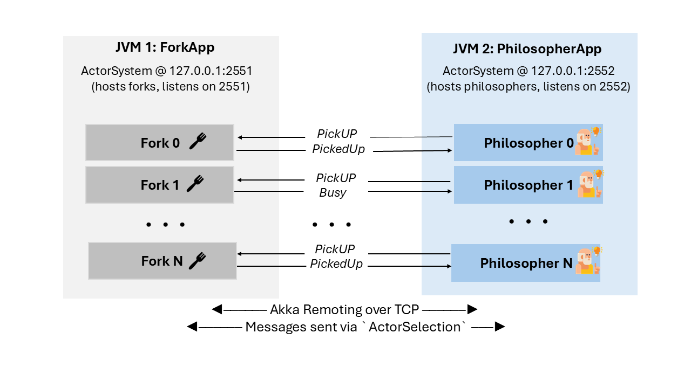

# Solving the Dining Philosophers Problem with Akka and P  
### *(Cloud Computing Project – 2025)*

Imagine five philosophers sitting at a round table. Between each pair, a single fork. To eat, a philosopher must hold **both** the left and right forks. But here’s the twist: if everyone reaches for the same fork first, they’ll all wait forever; a classic **deadlock**.

Originally proposed by Edsger Dijkstra in the 1970s, the Dining Philosophers problem elegantly captures the essence of **concurrency** and **resource contention**. In this project, we tackle this age-old challenge using two powerful tools:

- **Akka (Scala)** for actor-based concurrency and remote communication  
- **P language** for formal verification and deadlock detection  

---

## Part 1: Building the Solution in Akka

###  Architecture Overview

We model the system using Akka actors, each representing a **Philosopher** or a **Fork**.

| Component             | Description                                            |
|----------------------|--------------------------------------------------------|
| `Philosopher` actor  | Thinks, picks up forks, eats, and puts them down       |
| `Fork` actor         | Responds to `PickUp` and `PutDown` messages            |
| `ForkApp`            | Runs forks in a dedicated JVM (port 2551)              |
| `PhilosopherApp`     | Runs philosophers in another JVM (port 2552)           |
| `RemotePhilosopher`  | Handles remote communication using Akka’s `ActorSelection` |

---

### 🔒 Deadlock Prevention Strategy

To prevent circular waiting (a key ingredient for deadlocks), we introduce a simple tweak:

- **Philosophers 0–3** pick up their **left fork first**
- **Philosopher 4** picks up the **right fork first**

This asymmetry guarantees that at least one philosopher can always proceed, breaking the deadlock cycle.

---

## 💻 Option 1: All-in-One JVM Implementation

Before going distributed, we built a single-JVM version. **The same algorithm and deadlock-prevention strategy is shared across both Akka and P implementations (bonus)**:


###  Running the App (Single JVM)
First, navigate to the scala folder:
```bash
cd scala
```
To run with 5 philosophers:

```bash
sbt "runMain com.example.Main 5"  
```

You'll see philosophers thinking, eating, and releasing forks:


You can also pass a different number of philosophers(bonus):

```bash
sbt "runMain com.example.Main 7"  
```

###  Forcing a Deadlock

To simulate deadlock, make all philosophers pick the **left fork first** by uncommenting this block in `Main.scala`:

```scala
for (i <- 0 until N) {
  val left = forks(i)
  val right = forks((i + 1) % N)
  system.actorOf(Philosopher.props(s"Philosopher $i", left, right), s"Philosopher$i")
}
```

Run it again and observe:


The philosophers now wait forever, no one can proceed. **The system is deadlocked!**.

---

## 🌐 Option 2: Remote Multi-JVM Implementation (Bonus)

To push things further, we decouple philosophers and forks across two JVMs, using Akka’s remoting features:



###  Configuration Files

#### `fork.conf` (Fork JVM – port 2551)

```hocon
akka {
  actor.provider = "akka.remote.RemoteActorRefProvider"
  remote.artery {
    canonical.hostname = "127.0.0.1"
    canonical.port = 2551
  }
  actor {
    allow-java-serialization = on
    warn-about-java-serializer-usage = off
  }
  loglevel = "INFO"
}
```

#### `philosopher.conf` (Philosopher JVM – port 2552)

```hocon
akka {
  actor.provider = "akka.remote.RemoteActorRefProvider"
  remote.artery {
    canonical.hostname = "127.0.0.1"
    canonical.port = 2552
  }
  actor {
    allow-java-serialization = on
    warn-about-java-serializer-usage = off
  }
  loglevel = "INFO"
}
```

###  Running the Multi-JVM Version

1. **Fork JVM** (Terminal 1):

```bash
sbt "runMain com.example.ForkApp"
```

You should see:


2. **Philosopher JVM** (Terminal 2):

```bash
sbt "runMain com.example.PhilosopherApp"
```

Philosopher logs should now reflect remote interactions:


---

##  Part 2: Modeling with the P Language

Unlike Akka, which executes the system, **P** lets us **formally verify** its behavior, especially deadlock freedom. We model both safe and unsafe versions of the system in P, with the same fork acquisition strategy.

### 🛠 Variants Modeled

- **Variant 1 (Unsafe):** All philosophers pick **left** first → leads to **deadlock**
- **Variant 2 (Safe):** One philosopher picks **right** first → **no deadlock**

### Specification: `NoDeadlock`

We monitor the system using this assertion:

```p
spec NoDeadlock observes ForkGranted, ForkReleased {
  var holders: set[Philosopher];

  start state Monitoring {
    on ForkGranted do (p: Philosopher) {
      holders += (p);
      assert sizeof(holders) < 5, "Deadlock risk: All 5 philosophers hold a fork!";
    }
    on ForkReleased do (p: Philosopher) {
      holders -= p;
    }}}
```

If all 5 philosophers hold one fork each, no one can proceed ,deadlock is detected.

---

### ✅ Safe Version (Variant 2)

```p
test tcNoDeadlockV2 [main=TestV2]:
  assert NoDeadlock in (union Dining, { TestV2 });
```
Navigate to the p folder first:

```bash
cd p
```
 
Then run it with:

```bash
p check --testcase tcNoDeadlockV2
```

Output:


---

### ❌ Deadlock Version (Variant 1)

```p
test tcDeadlockV1 [main=TestV1]:
  assert NoDeadlock in (union Dining, { TestV1 });
```

```bash
p check --testcase tcDeadlockV1
```

Expected result:


You can also visualize execution with Peasy:


---


###  Parametric Extension in P (bonus)

While P doesn’t support runtime input like Scala’s `readInt()`, you can parameterize the number of philosophers by modifying the `TestV1` machine:

```p
machine TestV1 {
  start state Init {
    entry { SetupSystem(7, false); }
  }
}
```

Update the monitor accordingly:

```p
assert sizeof(holders) < 7, "Deadlock: All 7 philosophers hold a fork!";
```

---

## 🔗 References

- 📘 [Akka Docs](https://doc.akka.io/libraries/akka-core/current/)
- 📘 [P Language Guide](https://p-org.github.io/P/)
- 📘 [Dining Philosophers – Wikipedia](https://en.wikipedia.org/wiki/Dining_philosophers_problem)

---

## 🙏 Acknowledgments

This project was developed as part of the **Cloud Computing 2025** course with Prof. **Gustavo Petri**.   
Special thanks to him for his guidance and deep insights into concurrency and distributed systems.
